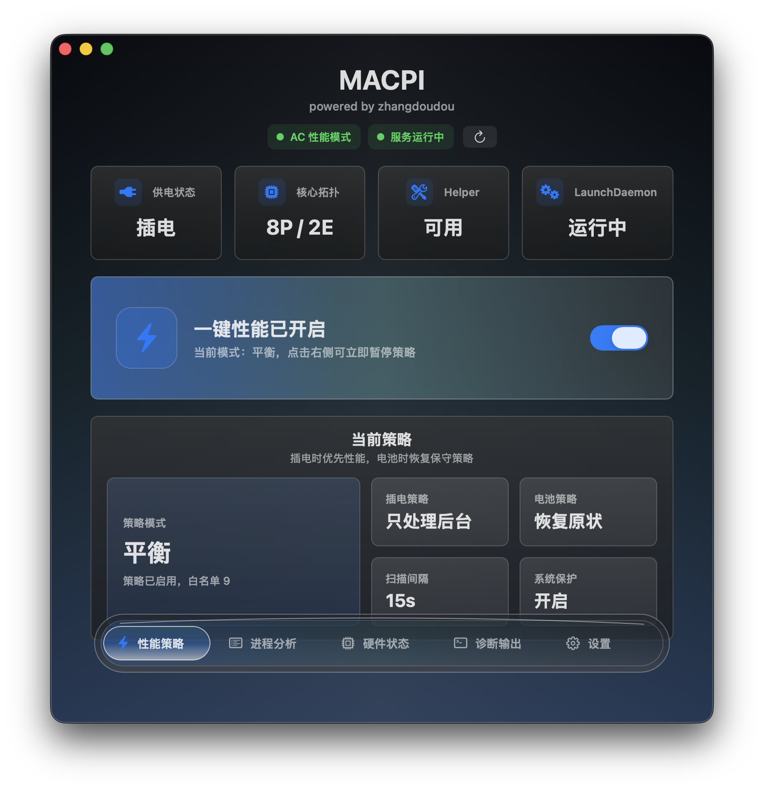

# MACPI

<p align="center">
  
</p>

<p align="center">
  <strong>Apple Silicon Mac 性能策略控制工具</strong>
</p>

<p align="center">
  
  
  
  
</p>

<p align="center">
  MACPI 是一个面向 Apple Silicon Mac 的 macOS 性能策略工具，包含命令行 helper、root LaunchDaemon 和原生图形界面。
</p>

<p align="center">
  
</p>

## 简介

MACPI 会监听当前 Mac 是插电还是电池供电，并在插电时将符合条件的进程从 Darwin background 后台优先级中移出，使系统调度策略更偏向性能侧。

需要先说明一个重要限制：macOS 没有公开 API 能让第三方程序把“所有已有进程”强制绑定到 P 核。Apple Silicon 的 P/E 核分配由内核调度器根据 QoS、优先级、功耗、温度等信息决定。

因此，MACPI 使用公开接口中对其它进程最接近目标的做法：

* 插电时优先通过原生 `setpriority(PRIO_DARWIN_PROCESS, pid, 0)` 把进程移出 Darwin background 后台优先级。
* 如果系统调用失败，再 fallback 到 `taskpolicy -B -p <pid>`。
* 默认不修改 macOS 低电量模式。
* 默认不修改 `powermode` / `highpowermode` 等 AC 电源模式。
* 只有显式传入 `--battery-low-power on/off` 时，才会修改电池档低电量模式。

## 功能特点

* 原生 macOS 图形界面。
* 当前供电状态、P/E 核心拓扑、helper 和 LaunchDaemon 状态显示。
* 支持跟随系统、简体中文、繁体中文、广东话和 English 的界面语言切换。
* 支持总开关、平衡 / 性能 / 激进三档策略模式。
* 默认保护系统关键进程，并默认跳过 root / system 进程。
* 提供进程分析页，用当前策略预估哪些进程会被处理、跳过或保护。
* 提供自测、dry-run 输出和诊断面板。
* 支持扫描间隔、同 PID 刷新间隔、恢复后台状态等配置。
* 可通过 macOS 管理员授权弹窗安装 / 更新 / 卸载 root LaunchDaemon，无需手动复制 sudo 命令。

GUI 本身是管理端；真正作用到系统进程的性能策略由 root LaunchDaemon 执行。

## 下载

前往 GitHub Releases 下载最新版本：

* `MACPI.app.zip`

下载后解压，打开 `MACPI.app` 即可。

如果 macOS 提示应用来自未知开发者，可以右键点击应用选择“打开”，或者前往：

```text
系统设置 → 隐私与安全性
```

手动允许打开。

## 系统要求

* macOS 13 或更新版本
* 推荐 Apple Silicon Mac
* 安装后台 helper / LaunchDaemon 时需要管理员权限

## 构建

构建命令行工具和 GUI：

```sh
swift build -c release
```

运行测试：

```sh
swift test
```

当前仓库的测试不需要 root 权限，也不会调用真实 `setpriority`、`taskpolicy` 或 `pmset` 去修改系统进程。

## 构建图形界面 App

构建 `.app`：

```sh
./scripts/build-app.sh
```

如果仓库中存在 `assets/AppIconSource.png`，构建脚本会自动生成 `AppIcon.icns` 并写入 `MACPI.app`。

打开：

```sh
open dist/MACPI.app
```

## 不改系统状态的试运行

```sh
.build/release/macpi status
.build/release/macpi once --dry-run
.build/release/macpi self-test
```

## 执行一次

如果要作用到系统进程，需要 root 权限：

```sh
sudo .build/release/macpi once
```

## 作为 LaunchDaemon 常驻运行

安装：

```sh
sudo ./scripts/install-launchdaemon.sh
```

查看日志：

```sh
tail -f /var/log/macpi.log /var/log/macpi.err
```

卸载：

```sh
sudo ./scripts/uninstall-launchdaemon.sh
```

LaunchDaemon 使用固定 label：

```text
com.local.macpi
```

默认路径：

```text
/Library/LaunchDaemons/com.local.macpi.plist
/usr/local/sbin/macpi
```

安装脚本会先 `bootout` 旧服务，确认停止后再以 staging 文件写入、`plutil -lint` 校验并原子替换。

## 策略模式

MACPI 提供总开关和三档策略模式。

| 模式            | 行为                                     |
| ------------- | -------------------------------------- |
| `balanced`    | 默认模式。只处理已处于 Darwin background 的当前用户进程。 |
| `performance` | 更积极地解除后台策略，但仍默认跳过 root / system 进程。    |
| `aggressive`  | 在 performance 基础上额外尝试 `renice -5`。     |

建议先使用默认 LaunchDaemon 和 `balanced` 模式。

`aggressive` 模式可能提高短时重负载表现，但也可能影响系统交互、温度和风扇表现。MACPI 会在切到电池、禁用策略或 daemon 退出时尝试恢复原始 nice 值，但高负载场景下仍建议谨慎使用。

## 参数

```text
macpi daemon [options]
macpi once [options]
macpi analyze [options]
macpi status
macpi self-test

--interval <seconds>        Daemon scan interval, minimum 3 seconds. Default: 15.
--reapply-interval <secs>   Minimum seconds before refreshing an already-seen PID. Default: 60.
--policy-disabled           Keep daemon running but do not change process or power policy.
--policy-enabled <bool>     true/false master switch. Default: true.
--policy-mode <mode>        balanced, performance, or aggressive. Default: balanced.
--dry-run                   Print intended actions without changing system state.
--aggressive-renice         Also renice touched processes to -5. Requires root and may be disruptive.
--no-power-settings         Do not call pmset.
--no-restore-background-on-battery
                             Do not restore originally backgrounded processes when switching to battery.
--no-protect-system-critical
                             Allow touching names in the system-critical protection list.
--include-system-processes  Allow non-user/root processes to be considered.
--battery-low-power <mode>  on, off, or unchanged. Default: unchanged.
--exclude <process-name>    Add a process basename to the exclusion list.
--whitelist <names>         Comma-separated process names to protect from MACPI policy.
--only-pid <pid>            Diagnostic/testing mode: touch only the supplied PID. Repeatable.
--limit <count>             analyze only: number of rows to print. Default: 40.
```

默认扫描间隔是 15 秒，默认同 PID 刷新间隔是 60 秒。插拔电不需要等待这个间隔，因为电源状态变化由 IOKit 通知立即触发。

`--only-pid` 主要用于测试或排查单个进程。正常常驻运行会扫描系统进程表。

`self-test` 会创建一个临时 `sleep` 进程，验证“插电策略解除 Darwin background，电池策略恢复 Darwin background”这一组核心行为，不会扫描或修改全系统进程。

## 进程身份与恢复机制

守护模式下，MACPI 会通过 IOKit 监听电源状态变化：插电 / 拔电会立即切换策略。

同时它会用 libproc 原生枚举进程，并按固定间隔补扫新启动的进程。为了避免 PID 复用误判，策略状态缓存使用：

```text
pid + process start time
```

作为进程身份。

如果无法严格读取身份，MACPI 会保守跳过缓存和恢复。电池供电、禁用策略或 daemon 正常退出时，MACPI 会尝试恢复由本程序修改过的 Darwin background 和 nice 值。

## 电源模式说明

新版默认不写任何 AC 档：

```text
pmset powermode
pmset highpowermode
pmset lowpowermode
```

`--battery-low-power unchanged` 是 no-op。只有显式传入：

```text
--battery-low-power on
--battery-low-power off
```

时，才会修改电池档低电量模式。

如果你曾经安装过旧版 MACPI，并发现插电时 AC 低电量模式仍然开启，可以手动检查和恢复：

```sh
pmset -g custom
sudo pmset -c lowpowermode 0
```

MACPI 不会自动替用户改回 AC 低电量模式，以免在新版本中继续隐式写入电源配置。

## 打包

构建 GUI 应用：

```sh
./scripts/build-app.sh
```

构建源码包：

```sh
./scripts/package-source.sh
```

源码包只包含：

```text
Package.swift
README.md
.gitignore
assets/
Sources/
Tests/
scripts/
.github/
```

不会包含：

```text
.git/
.build/
.swiftpm/
dist/
__MACOSX/
.DS_Store
```

## 风险提示

MACPI 当前是早期公开版本。应用目前未签名、未公证。

部分功能需要管理员权限，因为后台 helper 会以系统 LaunchDaemon 的方式运行。请先阅读默认策略，再决定是否启用更激进的模式。
